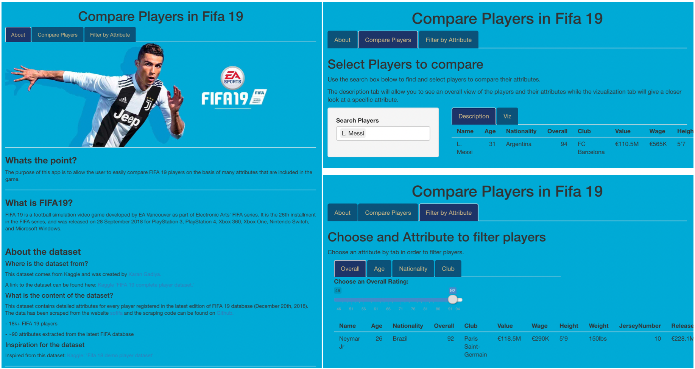

# R Shiny Fifa 19 App

> <b> R Shiny App created to explore and compare Fifa 19 players. </b>

## Project Overview
- Create a Shiny web application to explore a dataset of your choice
- App should be hosted on shinyapps.io

### App should contain:
- At least 3 different input types
- At least 2 different output types
- At least 3 tabPanels, including a Readme tab that explains:
- The purpose of the app
- The source of the data
- Any other information needed to use the app or interpret its results
- At least 1 image

### Links
A link to the code behind the R shiny app can be found [here](/R_Shiny_Assignment/app.R), and the data used for this project comes from Kaggle and was created by [Karan Gadiya](https://www.kaggle.com/karangadiya) and can be found [here](https://www.kaggle.com/karangadiya/fifa19).
